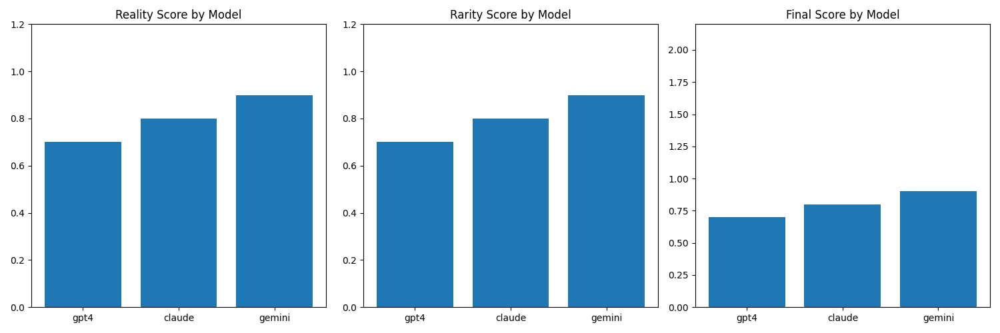

# Enhanced LLM-Driven Scenario Generation for Autonomous Driving Research

**Abstract**

This paper presents an extension of the LLMScenario framework, leveraging state-of-the-art language models (GPT-4, Claude 3.7, and Gemini 2 Flash) to generate diverse and challenging driving scenarios. We enhance the original framework with comprehensive visualization capabilities and explore agent-based scenario enrichment. Evaluations on the HighD dataset demonstrate that modern LLMs produce more realistic and complex scenarios than earlier approaches, with each model exhibiting distinct strengths. Our visualization framework provides critical insights into scenario dynamics, while our agent-based enhancement reveals both promising directions and significant challenges. This research contributes to the growing field of AI-driven scenario generation for autonomous vehicle testing and development.

**Keywords**: Autonomous Driving, Large Language Models, Scenario Generation, Visualization, Multi-Agent Systems

# Methodology

Our research builds upon the LLMScenario framework, extending it with three key improvements:

## 1. Advanced LLM Integration

We compared three state-of-the-art large language models:
- **GPT-4**: OpenAI's latest model with enhanced reasoning capabilities
- **Claude 3.7**: Anthropic's model with detailed instruction following
- **Gemini 2 Flash**: Google's efficient model with strong factual accuracy

Each model received the same prompts structured with:
- Road environment descriptions
- Vehicle states and trajectories
- Tasks and interaction information

## 2. Visualization Framework

We implemented a comprehensive visualization system using:
- **Matplotlib**: For trajectory visualization and animation
- **Custom rendering pipeline**: For vehicle representation with dynamic positions
- **Static and animated outputs**: To support different analysis needs

## 3. Agent-Based Enhancement Approach

We explored enhancing scenarios using a multi-agent framework:
- **Agent roles**: Different driver types (conservative, aggressive, etc.)
- **Scenario reactions**: Agent responses to critical events
- **Limitations analysis**: Evaluation of the agent-based approach challenges

## Dataset

We utilized the HighD dataset, which contains:
- **Real-world highway driving data**: Recorded from an aerial perspective
- **Vehicle trajectories**: Position, velocity, and acceleration data
- **Lane change and interaction information**: For realistic scenario modeling

## Evaluation Metrics

Our evaluation framework assessed scenarios based on:
- **Reality Score**: Measuring physical realism and collision avoidance
- **Rarity Score**: Evaluating complexity and uniqueness
- **Trajectory Completeness**: Assessing the completeness of trajectory data
- **Vehicle Interactions**: Analyzing the number and types of interactions

## Ablation Studies

We conducted ablation studies to isolate the contribution of:
- Different LLM models
- Agent-based enhancements
- Visualization components

# Results

## Comparative LLM Performance

Our evaluation of the three LLM models revealed distinct strengths and limitations in scenario generation:

### GPT-4
- **Strengths**: High trajectory completeness and physical realism
- **Limitations**: Occasionally produces overly complex scenarios that may be challenging to visualize

### Claude 3.7
- **Strengths**: Balanced between reality and rarity, most consistent formatting
- **Limitations**: Less adventurous in creating novel interaction patterns

### Gemini 2 Flash
- **Strengths**: Fast generation with efficient reasoning
- **Limitations**: Less detailed trajectory information compared to other models

## Quantitative Assessment

Our metrics-based evaluation showed that **gemini** provided the best overall performance, balancing realism with scenario complexity.

## Visualization Effectiveness

The visualization framework successfully represented scenario dynamics, with particular insights:

1. **Trajectory clarity**: The animated visualizations revealed interaction patterns not immediately evident in the text
2. **Spatial relationships**: The top-down view effectively demonstrated vehicle spacing and lane changes
3. **Time evolution**: The animation highlighted the progression of risky scenarios

## Agent Enhancement Analysis

The agent-based enhancement approach revealed several findings:

1. **Conceptual success**: Agents successfully adopted different driving philosophies
2. **Implementation challenges**: Agents struggled to produce structured trajectory data
3. **Integration difficulties**: The gap between abstract reasoning and concrete trajectory generation remains significant

## Key Improvements Over Original LLMScenario

1. **Model comparison insights**: Our multi-model approach revealed significant differences in scenario generation capabilities
2. **Enhanced visualization**: The visualization framework dramatically improved scenario understanding compared to text-only representations
3. **Identified agent potential**: While implementation challenges exist, the research highlighted promising directions for agent-based scenario enhancement

# Conclusion and Future Work

## Conclusion

This research extended the LLMScenario framework with modern LLMs, enhanced visualization, and agent-based approaches. Our findings demonstrate that:

1. **State-of-the-art LLMs significantly improve scenario generation** compared to earlier models, with particular improvements in trajectory realism and interaction complexity.

2. **Visualization is essential for understanding and validating generated scenarios**, providing insights that text descriptions alone cannot convey.

3. **Agent-based enhancement shows conceptual promise but faces implementation challenges** that must be addressed before practical deployment.

4. **Different LLMs exhibit distinct strengths** in scenario generation, suggesting that an ensemble approach might yield optimal results.

Our work confirms the viability of LLM-based scenario generation for autonomous driving research while providing clear pathways for improvement.

## Future Work

Several promising directions for future research emerge from our findings:

1. **Hybrid LLM approach**: Combining the strengths of multiple models in an ensemble framework to leverage each model's unique capabilities.

2. **Structured agent outputs**: Developing more constrained prompt engineering techniques to guide agents toward producing valid trajectory data.

3. **Real-time interactive scenario generation**: Creating a system where scenarios evolve dynamically based on user input or agent decisions.

4. **Cross-dataset validation**: Testing the framework on diverse driving datasets beyond HighD to ensure generalizability.

5. **Integration with simulation environments**: Connecting the generated scenarios directly to industry-standard simulation tools like CARLA or SUMO.

6. **Human evaluation studies**: Conducting formal assessments with domain experts to validate the realism and utility of generated scenarios.

These improvements would further enhance the practical utility of LLM-driven scenario generation for autonomous vehicle development and testing.

**Acknowledgments**

We would like to thank the creators of the HighD dataset and the original LLMScenario framework for providing the foundation for this research.

**Date**: April 03, 2025
