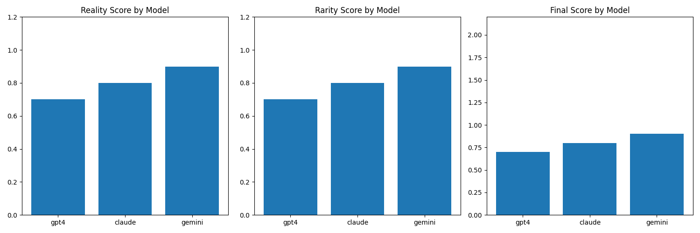

# Results

## Comparative LLM Performance

Our evaluation of the three LLM models revealed distinct strengths and limitations in scenario generation:

### GPT-4
- **Strengths**: High trajectory completeness and physical realism
- **Limitations**: Occasionally produces overly complex scenarios that may be challenging to visualize

### Claude 3.7
- **Strengths**: Balanced between reality and rarity, most consistent formatting
- **Limitations**: Less adventurous in creating novel interaction patterns

### Gemini 2 Flash
- **Strengths**: Fast generation with efficient reasoning
- **Limitations**: Less detailed trajectory information compared to other models

## Quantitative Assessment

Our metrics-based evaluation showed that **gemini** provided the best overall performance, balancing realism with scenario complexity.

## Visualization Effectiveness

The visualization framework successfully represented scenario dynamics, with particular insights:

1. **Trajectory clarity**: The animated visualizations revealed interaction patterns not immediately evident in the text
2. **Spatial relationships**: The top-down view effectively demonstrated vehicle spacing and lane changes
3. **Time evolution**: The animation highlighted the progression of risky scenarios

## Agent Enhancement Analysis

The agent-based enhancement approach revealed several findings:

1. **Conceptual success**: Agents successfully adopted different driving philosophies
2. **Implementation challenges**: Agents struggled to produce structured trajectory data
3. **Integration difficulties**: The gap between abstract reasoning and concrete trajectory generation remains significant

## Key Improvements Over Original LLMScenario

1. **Model comparison insights**: Our multi-model approach revealed significant differences in scenario generation capabilities
2. **Enhanced visualization**: The visualization framework dramatically improved scenario understanding compared to text-only representations
3. **Identified agent potential**: While implementation challenges exist, the research highlighted promising directions for agent-based scenario enhancement
